User Documentation
==================
All nodes provided by Continuum Flow are documented here. For some physical parameters, you can refer to the theory section to better understand what they do.

General Workflow
----------------
In general, Continuum Flow's workflow is node-based. After installation, there will be a new editor in the editor options at the top left, where you also find things like the UV Editor. Go there and create a new node tree. Then you can start setting up your simulation.

The solver simulates multiple fields. Things like velocity, pressure, and temperature are self-explanatory. One additional field transported by the flow is fuel, which can lead to burning when a high enough temperature is reached. Another is smoke, which can either be spawned by a source or be created through burning. Flames are also created during burning and produce additional temperature.

Nodes
-----
To avoid a tedious setup, a node tree preset is provided, which can be found by pressing Shift+A, like all other nodes. This node tree preset contains the minimum number of nodes necessary for a simulation.

Simulation
~~~~~~~~~~

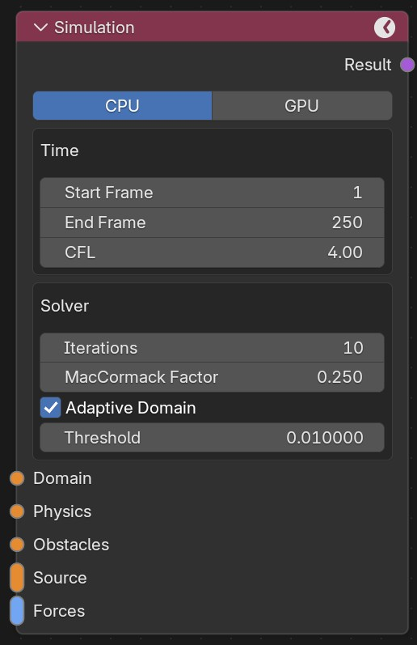

This is the core node of every simulation. It controls the frame range for your simulation and general solver parameters.

**CPU/GPU**
    Lets you choose whether you want to simulate on the CPU or GPU. Only NVIDIA GPUs are supported. If no compatible GPU is found, the GPU button will be unavailable.

**Start Frame**
    The frame at which the simulation starts.

**End Frame**
    The frame at which the simulation ends.

**CFL**
    This setting is very important. It determines how large or small the time steps of your simulation are. The solver has to simulate many more substeps than the frames in your scene. Larger CFL values mean bigger time steps, which means the solver is faster. In many cases, going for a high value here is good since it decreases the simulation time. In some situations, the visual quality will suffer under large CFL numbers. Refer to the best-practice section for more information.

**Iterations**
    Number of pressure iterations. Usually the default of ten is fine. Smaller values can be faster but may become unstable. Larger values are more stable but take longer.

**Adaptive Domain**
    Similar to Blender's native adaptive domain setting. It only simulates cells containing smoke, fuel, or fire. In many cases this can greatly improve performance. In some cases, however, it is worth turning it off. Refer to the best-practice section.

**Threshold**
    Threshold for when a cell is considered empty for the adaptive domain.

Domain
~~~~~~

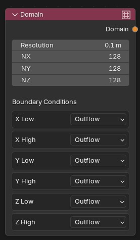

This node controls the size and resolution of your simulation domain. The domain is the area in which the simulation takes place.

**Resolution**
    The grid size used in the simulation. The grid size is the same in every direction.

**NX**
    Number of grid cells in x direction. 

**NY**
    Number of grid cells in y direction.

**NZ**
    Number of grid cells in z direction.

**Boundary Conditions**
    Lets you choose the boundary conditions for each face of your simulation domain.
    Outflow: fluid can leave the domain.
    Inflow: fluid can enter the domain at a given velocity.
    Slip Wall: frictionless wall.
    Wall: wall with friction.

Physics
~~~~~~~

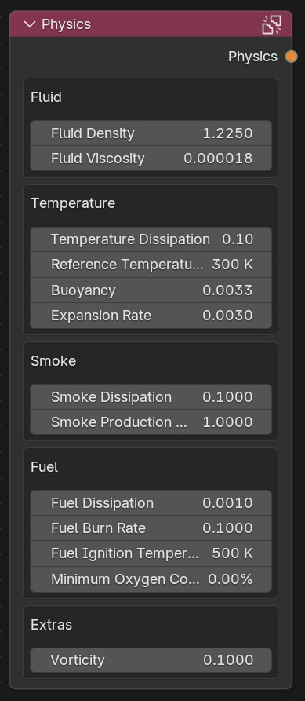

This node controls the general physics parameters of the simulation.

**Fluid Density**
    The density of the fluid. By default this is the density of air at room temperature.

**Fluid Viscosity**
    The viscosity of the fluid. By default this is the viscosity of air at room temperature.

**Temperature Dissipation**
    The rate at which temperature dissipates. Higher values mean faster dissipation.

**Reference Temperature**
    Air cooler than this temperature will sink down, while warmer air will rise.

**Buoyancy**
    Amount of buoyancy. Increasing this value means warm air will rise faster and cold air will sink faster.

**Expansion Rate**
    How much warm air expands. Increasing this leads to more expansion due to heat.

**Smoke Dissipation**
    The rate at which smoke dissipates. Higher values mean faster dissipation.

**Smoke Production**
    How much smoke is produced when burning.

**Fuel Dissipation**
    The rate at which fuel dissipates even without combustion. Higher values mean faster decay of the fuel field.

**Fuel Burn Rate**
    How quickly fuel burns away when ignited. Higher values mean faster burning.

**Fuel Ignition Temperature**
    If a cell contains fuel and the temperature is higher than this value, the fuel will ignite and produce flame and smoke.

**Minimum Oxygen Concentration**
    Minimum oxygen concentration required for fuel to burn. Oxygen concentration is approximated as 100 % minus the local smoke concentration, so higher smoke concentration leaves less oxygen available for combustion.

**Vorticity**
    Amount of extra vorticity in the simulation. Zero is physically accurate, but usually a small extra amount looks better.
    

Viewer
~~~~~~

This node lets you view the simulation domain in the viewport.

**Show/Hide Domain**
    Shows or hides the domain.

**Live Preview**
    When activated, the simulation can be seen in the viewport while simulating.

Output
~~~~~~

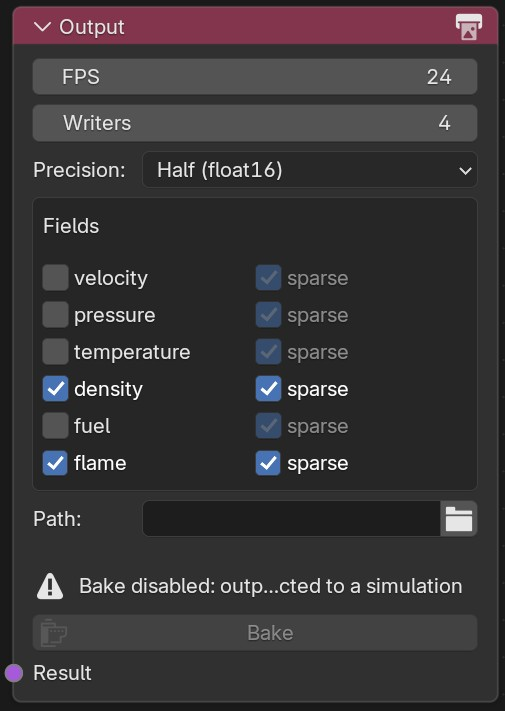

This node lets you specify the output of your simulation. It is worth paying some attention here, since simulations can create large amounts of data. Only save what you really need.

**FPS**
    The frame rate at which data is saved. Defaults to your scene frame rate.

**Writers**
    Number of writer CPU processes. Especially when simulating on the GPU, large amounts of data are calculated quickly and need additional compute power to be saved. Usually, the default value of four is fine.

**Precision**
    The floating point precision of the saved data. Usually float16 is fine. Only in rare occasions float32 might be necessary.

**Fields**
    Lets you select which of the available fields you want to save. The additional checkbox "sparse" can reduce the file size significantly for fields like fuel, flame, and density, since they usually do not fill the complete domain. If you select sparse for velocity, temperature, or pressure, the data is only saved in cells that also contain density. Be aware that in a simulation without any smoke, a sparse velocity field is empty.

**Path**
    Path on your disk where to save the data. You can use the usual Blender file browser.

**Bake/Free Bake**
    Bake: starts the simulation.
    Free Bake: deletes the baked data.

Obstacle
~~~~~~~~

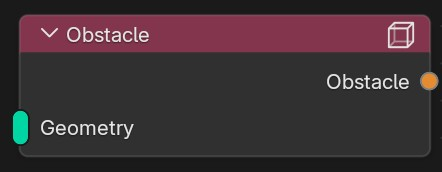

This node turns geometry into an obstacle. It expects a geometry node as input and accepts multiple inputs.

Source
~~~~~~

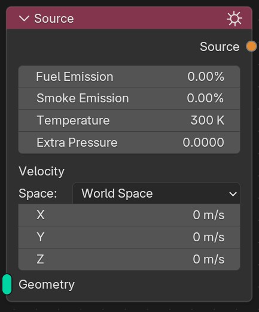

The Source node defines where fluid, smoke, temperature, pressure and velocity are spawned into the simulation. It expects a geometry node as input and accepts multiple inputs.

**Fuel Concentration**
    Fuel concentration spawned within the source. This value is specified in percent and limited to the range 0 to 100.

**Smoke Concentration**
    Smoke concentration spawned within the source. This value is specified in percent and limited to the range 0 to 100.

**Temperature**
    Temperature spawned within the source.

**Extra Pressure**
    Additional source term for the pressure solve. Positive values add extra pressure influence inside the source region, negative values remove it.

**Space**
    Choose whether the source velocity is interpreted in world coordinates or in the local coordinate system of each linked geometry object. With multiple geometry inputs in local space, each object applies the same authored velocity vector in its own local axes.

**Velocity**
    Velocity vector enforced within the source. Important: if all velocity values are zero, the source does not affect the velocity field at all. When you want to enforce zero velocity somewhere, use the obstacle node.

Geometry
~~~~~~~~

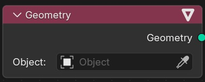

Simple node that lets you pick geometry. It can be plugged into the source or obstacle node.

Force-Constant
~~~~~~~~~~~~~~

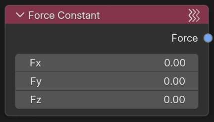

Adds constant forcing to the whole domain.

**Fx**
    Strength of the force in the x-direction.

**Fy**
    Strength of the force in the y-direction.

**Fz**
    Strength of the force in the z-direction.

Force-Turbulence
~~~~~~~~~~~~~~~~

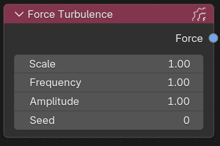

Adds turbulent forcing to the domain.

**Scale**
    Controls the scale of the introduced turbulence, larger values mean larger turbulent structures.

**Frequency**
    How quickly the turbulence field alternates. Larger values alternate more quickly.

**Amplitude**
    Amplitude of the turbulence.

**Seed**
    Random seed for turbulence field generation.

Force-Swirl
~~~~~~~~~~~

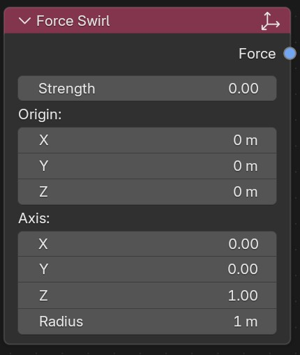

Adds swirly forcing to your simulation.

**Strength**
    How strong the swirl is supposed to be.

**Origin**
    Origin point of the swirl motion.

**Axis**
    Axis for the swirl. The flow will rotate around the line defined by Axis and Origin.

**Radius**
    Radius within which the swirl motion should be applied.

Force-Point
~~~~~~~~~~~

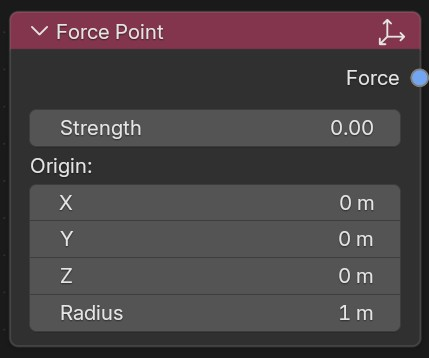

Adds a point force that can attract flow or push it away.

**Strength**
    Negative values mean attraction, while positive values push the flow away.

**Origin**
    Origin of the point force.

**Radius**
    Radius at which the force is still in effect.
