User Documentation
==================
All nodes provided by Continuum Flow are documented here.

General Workflow
----------------
In general, Continuum Flow's workflow is node-based. After installation, there will be a new editor in the editor options at the top left, where you also find things like the UV Editor. Go there and create a new node tree. Then you can start setting up your simulation.

The solver simulates multiple fields. Things like velocity, pressure, and temperature are self-explanatory. One additional field transported by the flow is fuel, which can lead to burning when a high enough temperature is reached. Another is smoke, which can either be spawned by a source or be created through burning. Flames are also created during burning and produce additional temperature.

Many simulation settings can be animated with Blender keyframes. This includes physics values, source temperature, smoke, fuel, extra pressure and velocity, constant-force components, swirl settings, and turbulence amplitude. Source and obstacle object transformations are animated as well. Values are sampled over the configured simulation frame range during export.

Nodes
-----
To avoid a tedious setup, a node tree preset is provided, which can be found by pressing Shift+A, like all other nodes. This node tree preset contains the minimum number of nodes necessary for a simulation.

Simulation
~~~~~~~~~~

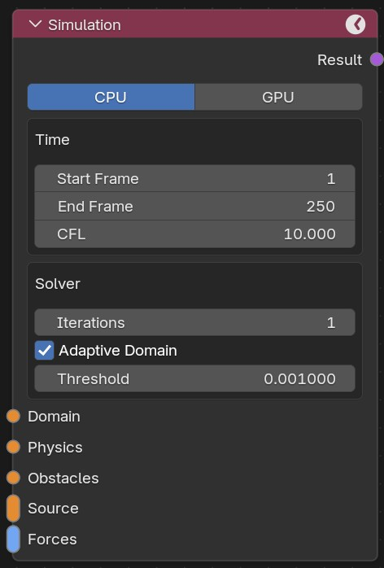

This is the core node of every simulation. It controls the frame range for your simulation and general solver parameters.

**CPU/GPU**
    Lets you choose whether you want to simulate on the CPU or GPU. Only NVIDIA GPUs are supported. If no compatible GPU is found, the GPU button will be unavailable.

**Start Frame**
    The frame at which the simulation starts.

**End Frame**
    Defines the end of the simulation interval. The simulation duration is calculated from ``End Frame - Start Frame``, and exported animation samples use the End Frame as their exclusive upper bound.

**CFL**
    This setting is very important. It determines how large or small the time steps of your simulation are. The solver has to simulate more substeps than the frames in your scene. Larger CFL values mean bigger time steps, which means the solver is faster. In many cases, going for a high value here is good since it decreases the simulation time. In some situations, the visual quality will suffer under large CFL numbers.

**Iterations**
    Number of solver iterations. Usually the default of one is sufficient. Fewer iterations result in a faster solve, but this can come at the cost of visual consistency.

**Adaptive Domain**
    Similar to Blender's native adaptive domain setting. It only simulates cells containing smoke, fuel, or fire. In many cases this can greatly improve performance.

**Threshold**
    Threshold for when a cell is considered empty for the adaptive domain.

Domain
~~~~~~

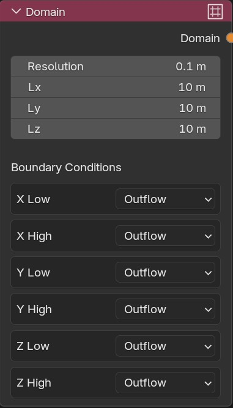

This node controls the size and resolution of your simulation domain. The domain is the area in which the simulation takes place.

**Resolution**
    The grid size used in the simulation. The grid size is the same in every direction.

**Lx**
    Requested domain length in x direction, in meters. The exported cell count is rounded up to a complete tile.

**Ly**
    Requested domain length in y direction, in meters. The exported cell count is rounded up to a complete tile.

**Lz**
    Requested domain length in z direction, in meters. The exported cell count is rounded up to a complete tile.

**Boundary Conditions**
    Lets you choose the boundary conditions for each face of your simulation domain.
    Outflow: fluid can leave the domain.
    Inflow: fluid can enter the domain at a given velocity.
    Slip Wall: frictionless wall.
    Wall: wall with friction.

Physics
~~~~~~~

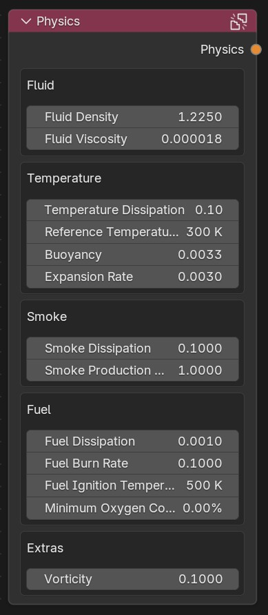

This node controls the general physics parameters of the simulation.

**Fluid Density**
    The density of the fluid. By default this is the density of air at room temperature.

**Fluid Viscosity**
    The viscosity of the fluid. By default this is the viscosity of air at room temperature.

**Temperature Dissipation**
    The rate at which temperature dissipates. Higher values mean faster dissipation.

**Temperature Production Rate**
    How much additional temperature is produced when fuel burns. Higher values make combustion heat the fluid more strongly.

**Reference Temperature**
    Air cooler than this temperature will sink down, while warmer air will rise.

**Buoyancy**
    Amount of buoyancy. Increasing this value means warm air will rise faster and cold air will sink faster.

**Expansion Rate**
    How much warm air expands. Increasing this leads to more expansion due to heat.

**Smoke Dissipation**
    The rate at which smoke dissipates. Higher values mean faster dissipation.

**Smoke Production**
    How much smoke is produced when burning.

**Fuel Dissipation**
    The rate at which fuel dissipates even without combustion. Higher values mean faster decay of the fuel field.

**Fuel Burn Rate**
    How quickly fuel burns away when ignited. Higher values mean faster burning.

**Fuel Ignition Temperature**
    If a cell contains fuel and the temperature is higher than this value, the fuel will ignite and produce flame and smoke.

The following two settings control the procedural variation of combustion:

**Scale**
    Spatial scale of the procedural randomness applied to the combustion process.

**Amplitude**
    Strength of the procedural modulation of the local fuel burn rate. Higher values produce greater spatial variation in combustion.

**Vorticity**
    Amount of extra vorticity in the simulation. Zero is physically accurate, but usually an extra amount looks better.
    

Viewer
~~~~~~

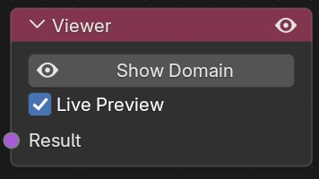

This node lets you view the simulation domain in the viewport.

**Show/Hide Domain**
    Shows or hides a viewport wireframe preview of the simulation-domain bounds and one sample grid cell. It does not create or hide simulation geometry.

**Live Preview**
    When activated, the simulation can be seen in the viewport while simulating.

Output
~~~~~~

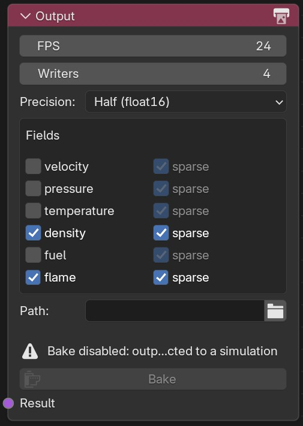

This node lets you specify the output of your simulation. It is worth paying some attention here, since simulations can create large amounts of data. Only save what you really need.

**FPS**
    The frame rate at which data is saved. Defaults to your scene frame rate.

VDB writer processes start with four workers and scale up automatically whenever the
solver has only one free writer left. This warms up extra workers before they are
needed. The maximum adapts to the number of logical CPU cores. It uses at most
half of them and is limited to a value between 4 and 32.

**Precision**
    The floating point precision of the saved data. Usually float16 is fine. Only in rare occasions float32 might be necessary.

**Fields**
    Lets you select which fields to save: velocity, pressure, temperature, density, fuel, and flame. Density and flame are enabled by default; the other fields are disabled by default. Enabling fewer fields reduces storage use and output overhead.

**Path**
    Path on your disk where to save the data. You can use the usual Blender file browser.

**Bake/Free Bake**
    Bake: starts the simulation.
    Free Bake: deletes the baked data.
    Press Esc during an active bake to request a clean cancellation.

Obstacle
~~~~~~~~

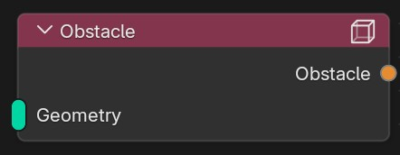

This node turns geometry into an obstacle. It expects a geometry node as input and accepts multiple inputs.

Source
~~~~~~

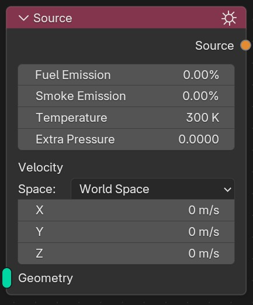

The Source node defines where fluid, smoke, temperature, pressure and velocity are spawned into the simulation. It expects a geometry node as input and accepts multiple inputs.

**Fuel Emission**
    Amount of fuel emitted within the source over time.

**Smoke Emission**
    Amount of smoke emitted within the source over time.

**Temperature**
    Temperature spawned within the source.

**Extra Pressure**
    Additional pressure spawned.

**Source Noise**
    Activates procedural spatial variations of temperature, smoke emission, fuel emission, and extra pressure to create more dynamic flow. Source velocity is not affected.

**Scale**
    Approximate feature size of the source noise in voxels. Larger values produce broader variations.

**Seed**
    Random seed used to produce a repeatable source-noise pattern.

**Amplitude**
    Amplitude of the noise. The emission of smoke and fuel is still always capped at 100%.

**Velocity**
    Velocity vector enforced within the source. Important: if all velocity values are zero, the source does not affect the velocity field at all. When you want to enforce zero velocity somewhere, use the obstacle node.

Geometry
~~~~~~~~

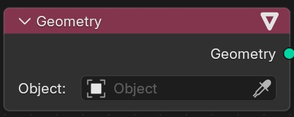

Simple node that lets you pick geometry. It can be plugged into the source or obstacle node.

Force-Constant
~~~~~~~~~~~~~~

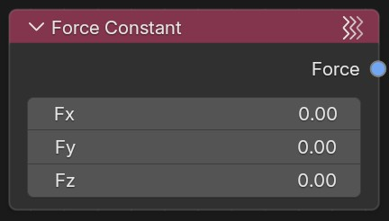

Adds constant forcing to the whole domain.

**Fx**
    Strength of the force in the x-direction.

**Fy**
    Strength of the force in the y-direction.

**Fz**
    Strength of the force in the z-direction.

Force-Turbulence
~~~~~~~~~~~~~~~~

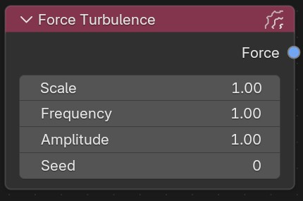

Adds turbulent forcing to the domain.

**Scale**
    Controls the scale of the introduced turbulence, larger values mean larger turbulent structures.

**Frequency**
    How quickly the turbulence field alternates. Larger values alternate more quickly.

**Amplitude**
    Amplitude of the turbulence.

**Seed**
    Random seed for turbulence field generation.

Force-Swirl
~~~~~~~~~~~

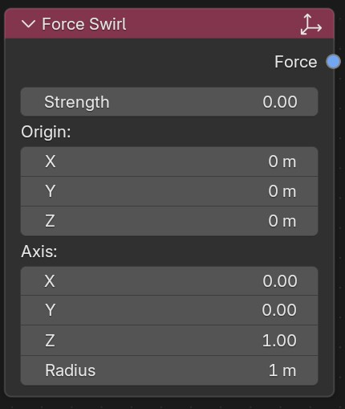

Adds swirly forcing to your simulation.

**Strength**
    How strong the swirl is supposed to be.

**Origin**
    Origin point of the swirl motion.

**Axis**
    Axis for the swirl. The flow will rotate around the line defined by Axis and Origin.

**Radius**
    Radius within which the swirl motion should be applied.

