User Documentation
==================
All nodes provided by Continuum Flow are documented here.

General Workflow
----------------
In general, Continuum Flow's workflow is node-based. After installation, there will be a new editor in the editor options at the top left, where you also find things like the UV Editor. Go there and create a new node tree. Then you can start setting up your simulation.

The solver simulates multiple fields. Things like velocity, pressure, and temperature are self-explanatory. One additional field transported by the flow is fuel, which can lead to burning when a high enough temperature is reached. Another is smoke, which can either be spawned by a source or be created through burning. Flames are also created during burning and produce additional temperature.

Many simulation settings can be animated. This includes physics values, source temperature, smoke, fuel, extra pressure and velocity, constant-force components, and swirl settings. Please note that the animated values in the UI will not create appear in the timeline, graph editor or dope sheet. Nonetheless they work and the simulation will react to the animated change. Source and obstacle object transformations are animated as well.

Nodes
-----
To avoid a tedious setup, a node tree preset is provided, which can be found by pressing Shift+A, like all other nodes. This node tree preset contains the minimum number of nodes necessary for a simulation.

Simulation
~~~~~~~~~~

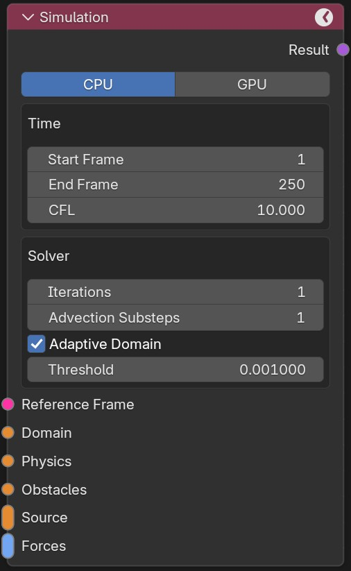

This is the core node of every simulation. It controls the frame range for your simulation and general solver parameters.

**CPU/GPU**
    Lets you choose whether you want to simulate on the CPU or GPU. Only NVIDIA GPUs are supported. If no compatible GPU is found, the GPU button will be unavailable.

**Start Frame**
    The frame at which the simulation starts.

**End Frame**
    Defines the end of the simulation interval.

**CFL**
    This setting is very important. It determines how large or small the time steps of your simulation are. The solver has to simulate more substeps than the frames in your scene. Larger CFL values mean bigger time steps, which means the solver is faster. In many cases, going for a high value here is good since it decreases the simulation time. In some situations, the visual quality will suffer under large CFL numbers.

**Iterations**
    Number of solver iterations. Usually the default of one is sufficient. 

**Advection Supsteps**
    The solver tries to trace the flow through a grid. This value dertermines with how many steps this tracing is done per time step. Usually the default of one is fine. When using large CFL values increasing this can improve results, but also increase simulation time slightly.

**Adaptive Domain**
    Similar to Blender's native adaptive domain setting. It only simulates cells containing smoke, fuel, or fire. In many cases this can greatly improve performance and significantly reduce (V)RAM usage.

**Threshold**
    Threshold for when a cell is considered empty for the adaptive domain.

Reference Frame
~~~~~~~~~~~~~~~

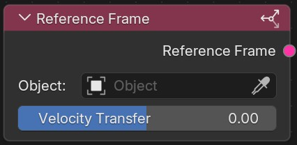

By default the domain is placed at the worlds center. If you want to move the domain you can use this node. The domain will follow the position of the selected objects origin. This is essentially like "parenting".

**Velocity Transfer**
    If the selected object moves during simulation this determines how much the flow is affected by this. A value of zero means now effect.

Domain
~~~~~~

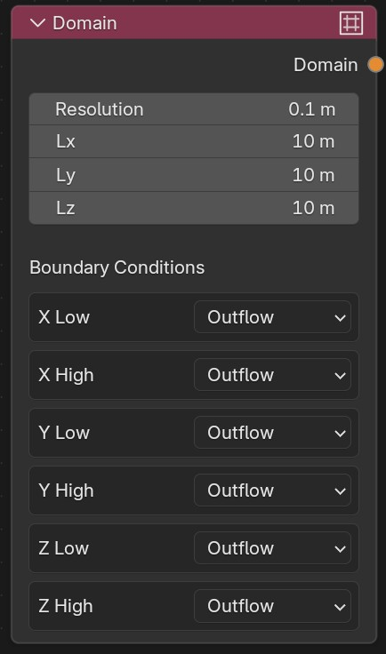

This node controls the size and resolution of your simulation domain. The domain is the area in which the simulation takes place.

**Resolution**
    The grid size used in the simulation. The grid size is the same in every direction.

**Lx**
    Requested domain length in x direction, in meters.

**Ly**
    Requested domain length in y direction, in meters. 

**Lz**
    Requested domain length in z direction, in meters.

Please Note: Due to some solver constraints the Domain will only approximate the size given by Lx, Ly and Lz. There might be very small deviations between the given size and the true size of the domain!

**Boundary Conditions**
    Lets you choose the boundary conditions for each face of your simulation domain.
    Outflow: flow can leave the domain.
    Inflow: flow can enter the domain at a given velocity.
    Slip Wall: frictionless wall.
    Wall: wall with friction.

Physics
~~~~~~~

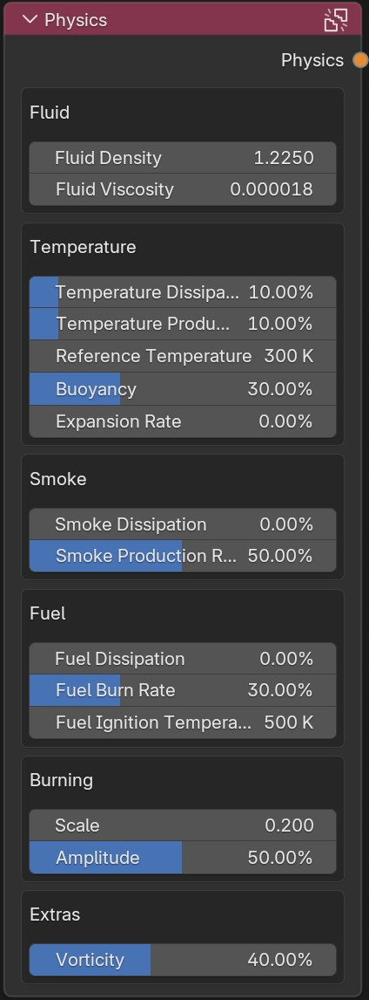

This node controls the general physics parameters of the simulation.

**Fluid Density**
    The density of the fluid. By default this is the density of air at room temperature.

**Fluid Viscosity**
    The viscosity of the fluid. By default this is the viscosity of air at room temperature.

**Temperature Dissipation**
    The rate at which temperature dissipates. Higher values mean faster dissipation.

**Temperature Production Rate**
    How much additional temperature is produced when fuel burns. Higher values make combustion heat the fluid more strongly.

**Reference Temperature**
    Air cooler than this temperature will sink down, while warmer air will rise.

**Buoyancy**
    Amount of buoyancy. Increasing this value means warm air will rise faster and cold air will sink faster.

**Expansion Rate**
    How much warm air expands. Increasing this leads to more expansion due to heat.

**Smoke Dissipation**
    The rate at which smoke dissipates. Higher values mean faster dissipation.

**Smoke Production**
    How much smoke is produced when burning.

**Fuel Dissipation**
    The rate at which fuel dissipates even without combustion. Higher values mean faster decay of the fuel field.

**Fuel Burn Rate**
    How quickly fuel burns away when ignited. Higher values mean faster burning.

**Fuel Ignition Temperature**
    If a cell contains fuel and the temperature is higher than this value, the fuel will ignite and produce flame and smoke.

**Fuel Ignition Temperature Tolerance**
    Temperature range over which combustion ramps from unlit to its full burn rate.

**Vorticity**
    Amount of extra vorticity in the simulation. Zero is physically accurate, but usually an extra amount looks better.
    

Viewer
~~~~~~

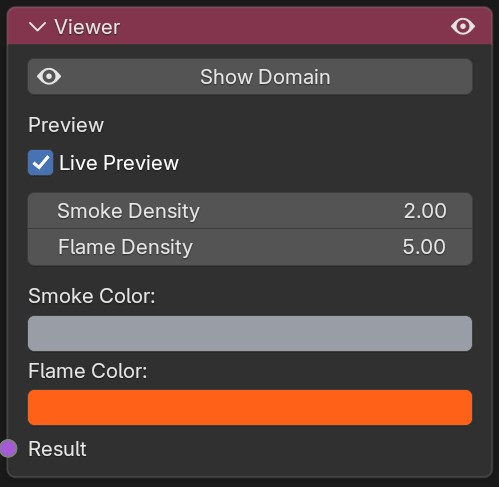

This node lets you view the simulation domain in the viewport.

**Show/Hide Domain**
    Shows or hides a viewport wireframe preview of the domain.

**Live Preview**
    If active a live preview of the simulation is shown in the viewport. Please note that this option can reduce the solvers performance.

**Smoke Density**
    Density of the preview smoke. Only affects the preview not the final output!

**Flame Density**
    Density of the preview flame. Only affects the preview not the final output!

**Smoke Color**
    Color of the preview smoke.

**Flame Color**
    Color of the preview flame.

Output
~~~~~~

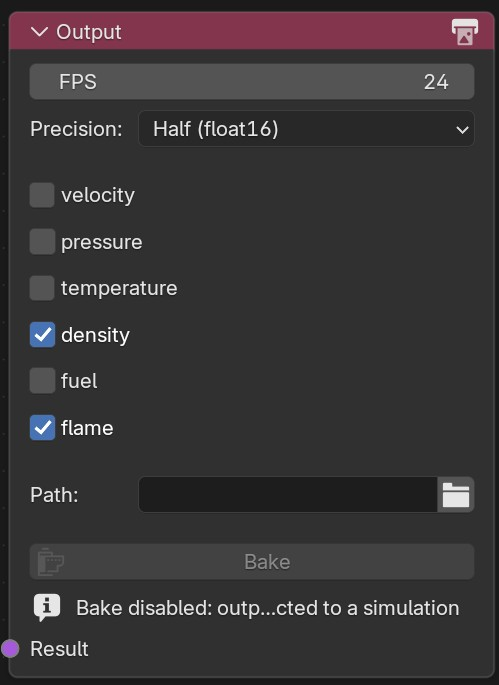

This node lets you specify the output of your simulation. It is worth paying some attention here, since simulations can create large amounts of data. Only save what you really need.

**FPS**
    The frame rate at which data is saved. Defaults to your scene frame rate.

**Precision**
    The floating point precision of the saved data. Usually float16 is fine. Only in rare occasions float32 might be necessary.

**Fields**
    Lets you select which fields to save: velocity, pressure, temperature, density, fuel, and flame. Density and flame are enabled by default; the other fields are disabled by default. Enabling fewer fields reduces storage use and output overhead.

**Path**
    Path on your disk where to save the data.

**Bake/Free Bake**
    Bake: starts the simulation.
    Free Bake: deletes the baked data.
    Press Esc during an active bake to stop.

Obstacle
~~~~~~~~

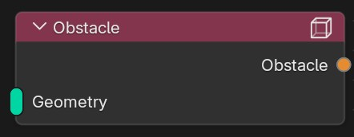

This node turns geometry into an obstacle. It expects a geometry node as input and accepts multiple inputs.

Source
~~~~~~

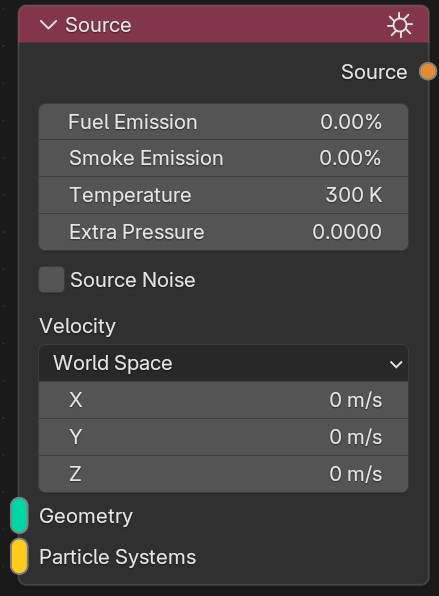

The Source node defines where fluid, smoke, temperature, pressure and velocity are spawned into the simulation. It expects a geometry node or a particle node as input and accepts multiple inputs.

**Fuel Emission**
    Amount of fuel emitted within the source over time.

**Smoke Emission**
    Amount of smoke emitted within the source over time.

**Temperature**
    Temperature present within the source.

**Extra Pressure**
    Additional pressure created. Positive values push flow away, negative values suck the flow in.

**Randomness Scale / Seed**
    Define one shared, world-space gradient-noise field for the source.

**Fuel / Smoke / Temperature / Extra Pressure Randomness**
    Control how strongly the shared noise field modulates each source value from zero to one hundred percent.

**World/local Space**
    In world space the velocity will be added aligned to the global coordinate system. When local is selected the velocity is aligned according to each source objects local cooordinate system. Particles are not affected by this setting.

**Velocity Randomness**
    Controls how strongly the shared source noise field modulates velocity from zero to one hundred percent.

**Velocity**
    Velocity vector enforced within the source. Important: if all velocity values are zero, the source does not affect the velocity field at all. When you want to enforce zero velocity somewhere, use the obstacle node.

Geometry
~~~~~~~~

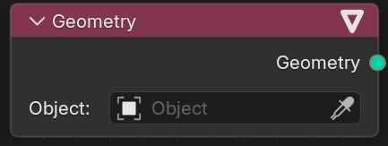

Node that lets you pick geometry. It can be plugged into the source or obstacle node.

Particle System
~~~~~~~~~~~~~~~

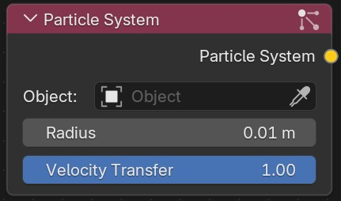

This node lets you first select an object and then a particle system belonging to that object. The particle system can act as a source for the simulation when plugged into the source node. 

**Radius**
    Radius aroung each particle in which a voxel is considered a source.

**Velocity Transfer**
    Percentage of the particle velocity transferred to the flow. Values above 100% can be entered manually.

Force-Constant
~~~~~~~~~~~~~~

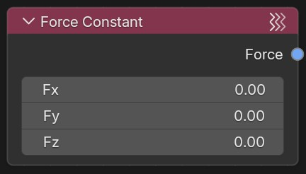

Adds constant forcing to the whole domain.

**Fx**
    Strength of the force in the x-direction.

**Fy**
    Strength of the force in the y-direction.

**Fz**
    Strength of the force in the z-direction.

Force-Turbulence
~~~~~~~~~~~~~~~~

Adds gradient-noise forcing to the domain.

**Scale**
    Spatial scale of the turbulence field in world units, independent of grid resolution.

**Seed**
    Seed used to generate the turbulence field.

**Amplitude**
    Strength applied to the generated noise value.

**Frequency**
    Controls the animated ``sin(time * frequency)`` force multiplier.

Force-Swirl
~~~~~~~~~~~

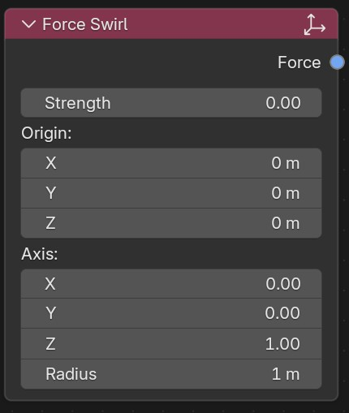

Adds swirly forcing to your simulation.

**Strength**
    How strong the swirl is supposed to be.

**Origin**
    Origin point of the swirl motion.

**Axis**
    Axis for the swirl. The flow will rotate around the line defined by Axis and Origin.

**Radius**
    Radius within which the swirl motion should be applied.

